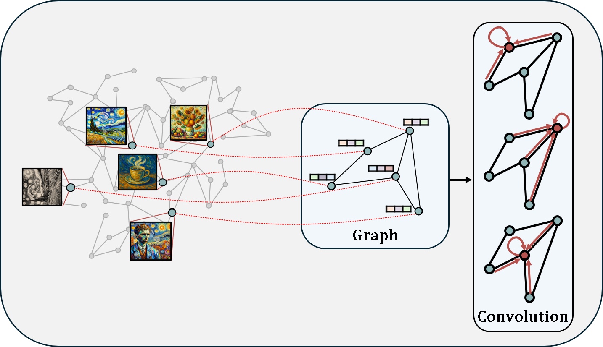

# DeepHashing
This is a PyTorch implementation of a deep hashing algorithm integrated with a __mini-batch-based graph construction__ module. The provided experiments and dataset use [Stanford Cars](https://ai.stanford.edu/~jkrause/cars/car_dataset.html). Please follow the instructions below to set up the experimental environment.

# 
