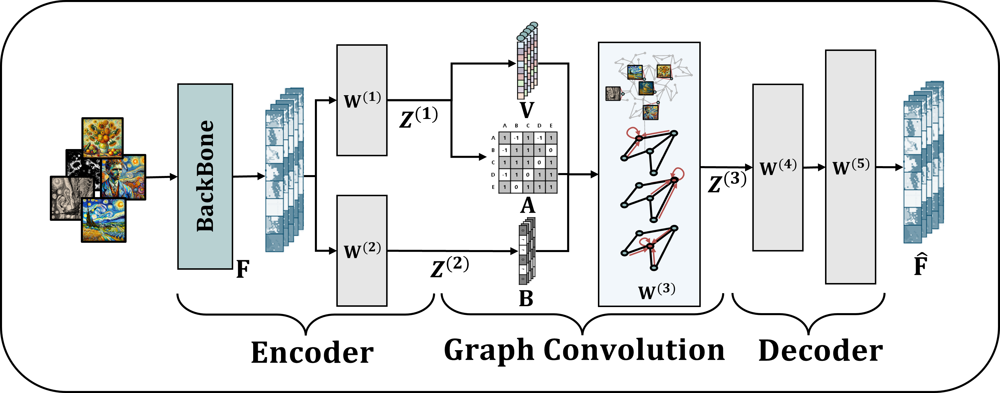

<div align="center">

# Enhancing deephashing with graph filters and autoencoder-based embeddings


<div align="left">

## Description

*This is a PyTorch implementation of a deep hashing algorithm integrated with a __mini-batch-based graph construction__ module. The provided experiments and dataset use [Stanford Cars](https://ai.stanford.edu/~jkrause/cars/car_dataset.html).
This code implements a basic image retrieval pipeline using the proposed self-supervised deep hashing model, HAGCN. The script takes an embedded dataset of images generated by the backbone model as input. After tuning the model's hyperparameters, the training process allows the model to generate binary hash codes. The code is modular, with separate functions for data loading, preprocessing, feature extraction, model training, and evaluation. In the final part of the script, the model is tested on a test dataset to demonstrate its retrieval capabilities.*

## Dataset Information

HAGCN is tested using the benchmark datasets [STL-10](https://cs.stanford.edu/~acoates/stl10/), [Stanford Cars](https://ai.stanford.edu/~jkrause/cars/car_dataset.html), and [Tiny ImageNet](https://www.kaggle.com/c/tiny-imagenet). 

The STL-10 dataset is a computer vision benchmark with 10 classes of images of size 96 × 96, which is widely used for tasks such as representation learning, deep hashing, and self-supervised learning.
Each image has a resolution of 96×96. 

The Stanford Car dataset contains over 16,000 images across 196 classes, based on car manufacturer and model year. 
The images are of varying resolutions, but most are high-resolution, typically around 300×300 to 600×600 pixels. All images were resized to 224×224. This dataset shows the visual differences in car model designs over time and is used to evaluate models for fine-grained recognition and transfer learning in computer vision. 

The Tiny ImageNet dataset consists of 200 classes and 500 training images per class, and the ImageNet images are downsampled to 64×64. This dataset helps evaluate the scalability and robustness of the model for different object types.

The downloaded images must be embedded into 1-dimensional vectors of size 784 using the [ViT B/16](https://docs.pytorch.org/vision/main/models/generated/torchvision.models.vit_b_16.html) model.
For faster experimentation, Please download the pre-embedded image dataset for the experiment:  you can download the pre-embedded [Stanford_Cars dataset](https://drive.google.com/file/d/1s39IUmYMnvvwMu1eotckh3HF6Mr1QvUt/view?usp=drive_link).

## Code Information
### 1. Model.py

This source file contains the direct implementation of the HAGCN model.
First, the sigmoid function used for binarizing the hash codes is defined as follows.

```python 
class Asig(nn.Module):
    def forward(self, x, alpha):
        return torch.sigmoid(alpha*x)
```


## Usage Instructions & Requrements
Please follow the instructions below to set up the experimental environment.
To train the model, you need to set up the experimental environment. Use a virtual environment such as Anaconda to install the packages listed in the provided requirements.txt file. While various versions of Python modules may be used, the versions specified in the text file reflect the environment used in the experiments.

### 1. Clone the repository

```{shell}
git clone https://github.com/IDASooinKim/DeepHashing.git
```

### 2. Creating conda envs

```{shell}
conda create -n deephashing python=3.8
conda activate deephashing
```

### 3. Install requirements 

```{shell}
pip install -r requirements.txt
```

### 4. Training Data preparation

Each folder in the downloaded dataset represents a class, and each folder contains approximately 50 embeddings of the same class. If you wish to train with custom data, please follow the folder directory structure below.

```
project/
├── data/
│   ├── 0
|   |───── 0.npy
|   |───── 1.npy
│   └── 1
```

### 5. Model Train

Model training can be easily run using the command __python main.py__.
If you wish to adjust the batch size, number of epochs, or other parameters, please use the following command:

```{shell}
python main.py --num_epochs 200 --batch_size 64 --num_cls 10 
```

For detailed arguments, please refer to the arguments.py file.
